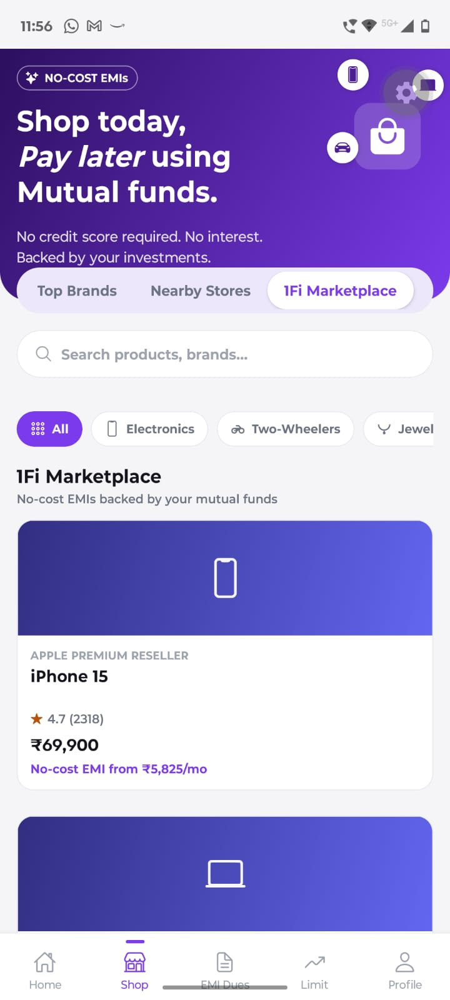
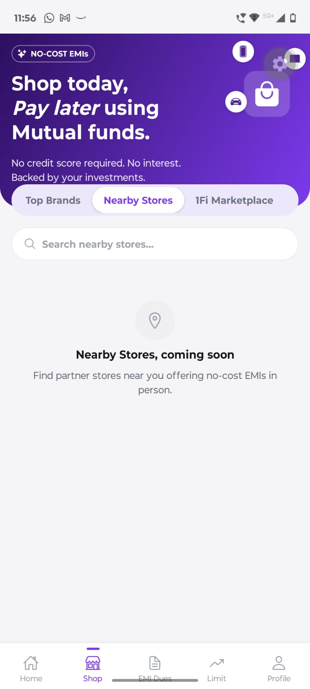
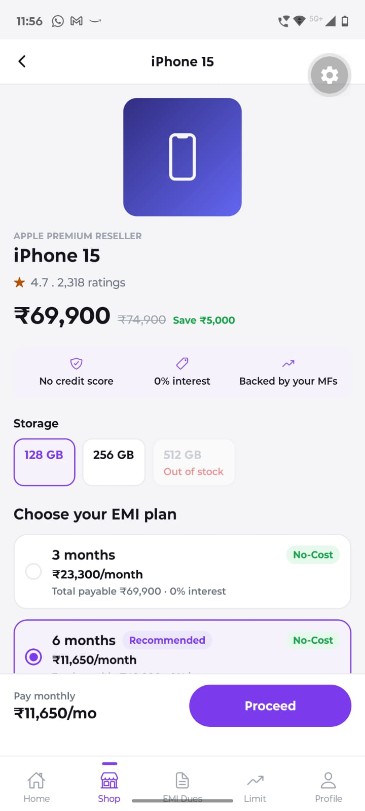
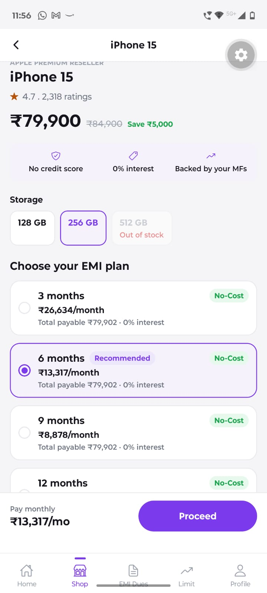
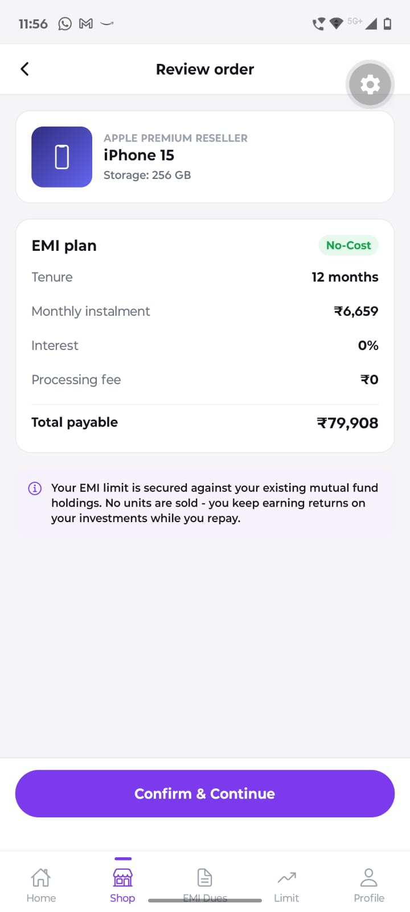
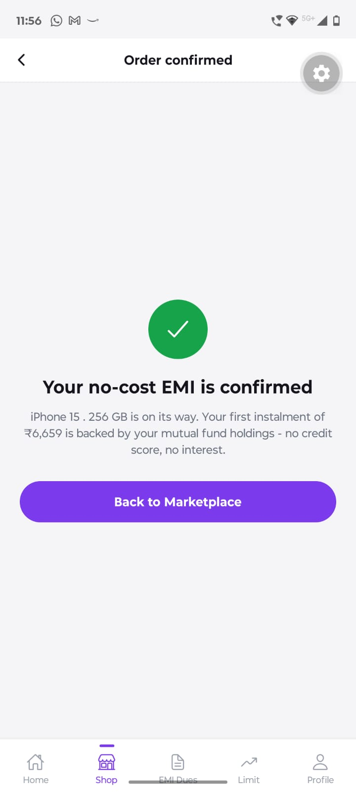
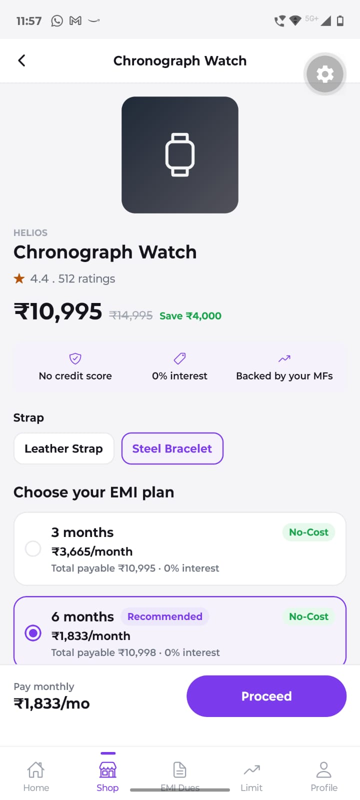
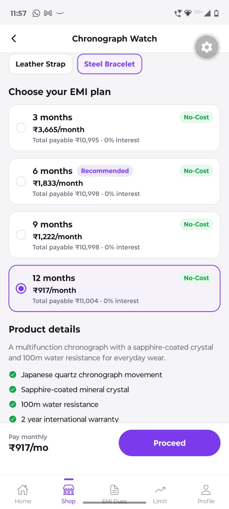
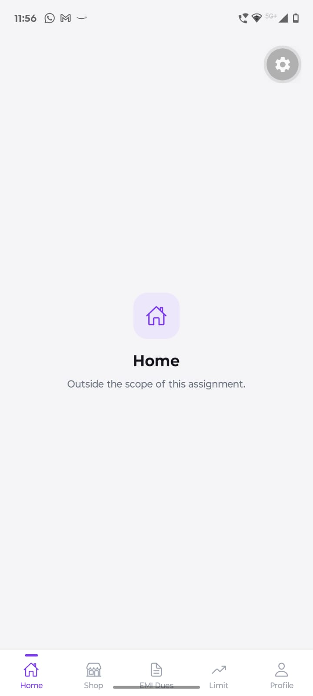
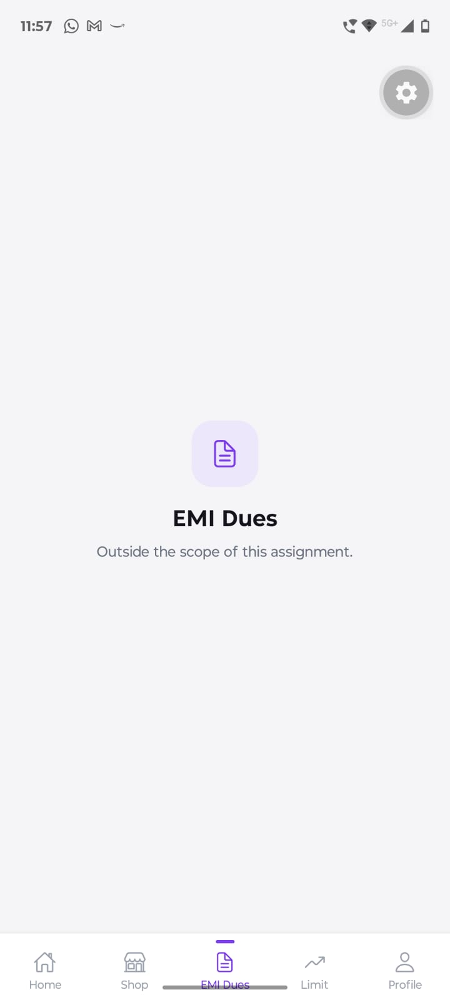

# 1Fi Marketplace — SDE Intern Assignment

React Native (Expo) build of the **1Fi Marketplace** section on the Shop page.

## What's here

- **Top Brands** / **Nearby Stores** — left blank, as the assignment specifies.
- **1Fi Marketplace** — fully built: browse by category → open a product → pick a variant and an EMI tenure → review → confirm.

## Proof it runs

Screenshots from an actual Expo Go session on a physical device, covering the full flow end to end.

| | |
|---|---|
|  Shop home: hero banner, tabs, category chips, Marketplace grid |  Nearby Stores tab — placeholder, as specified |
|  Product detail — iPhone 15, 128GB, price/rating render correctly |  256GB selected, EMI plan picker, 6 months (Recommended) |
|  Review order — product, EMI summary, total payable |  Order confirmed — success state after Confirm & Continue |
|  A different product (Helios watch) — Steel Bracelet variant selected, price updates |  EMI plans + product details/highlights section |
|  Home tab — placeholder, out of scope per the assignment |  EMI Dues tab — placeholder, out of scope per the assignment |

## Design

Colors, hero banner, tabs, search bar and cards are matched to screenshots of the real 1Fi Shop page (purple `#7C3AED`, white rounded cards, pill tabs, 5-tab bottom nav).

Two things aren't exact reproductions: product photos are gradient + icon placeholders (no real images available), and the hero illustration is a simplified icon composition rather than 1Fi's licensed 3D artwork.

## How it's built

- `src/data/` — mock product catalog
- `src/services/marketplaceApi.ts` — mock API with a delay and an occasional simulated failure, so loading/error states are real, not just decoration
- `src/hooks/` — React Query hooks (loading, error, retry, caching)
- `src/components/` — reusable UI: product cards, variant selector, EMI plan cards, buttons, empty/error states, etc.
- `src/screens/shop/` — Marketplace grid, product detail, review & confirm
- `src/navigation/` — bottom tabs + Shop stack

EMI plans (3/6/9/12 months, all no-cost) are calculated from the price, not hardcoded, so they always match whichever variant is selected.

## Run it

```bash
npm install
npx expo start
```

Scan the QR with Expo Go, or press `a` / `i` for an emulator.

## Notes

- `npx tsc --noEmit` passes clean.
- 9 products across 6 categories, covering multiple variants, an out-of-stock variant, and discounted pricing.
